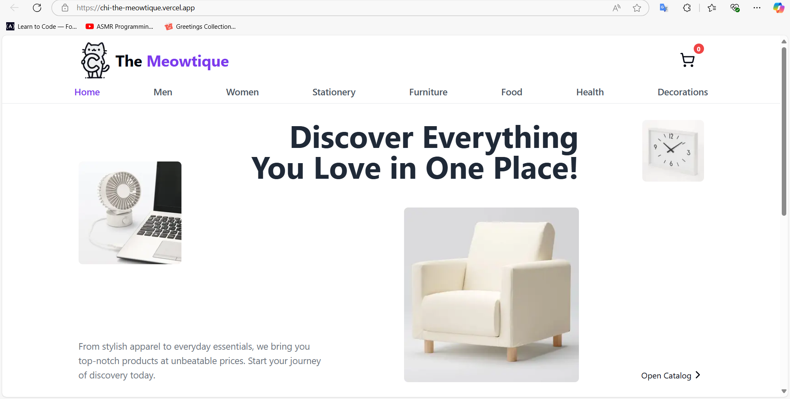
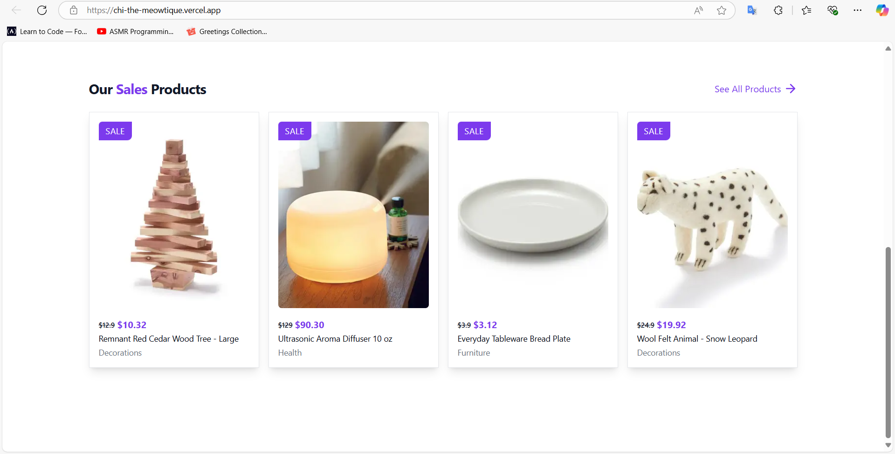
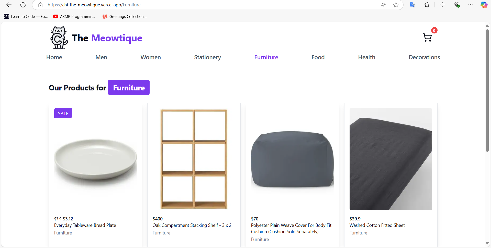
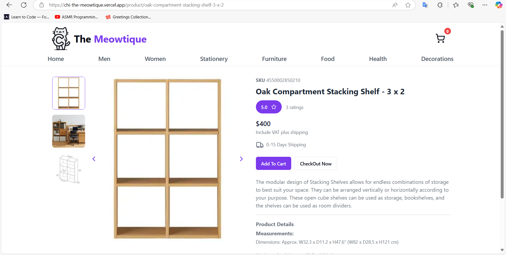
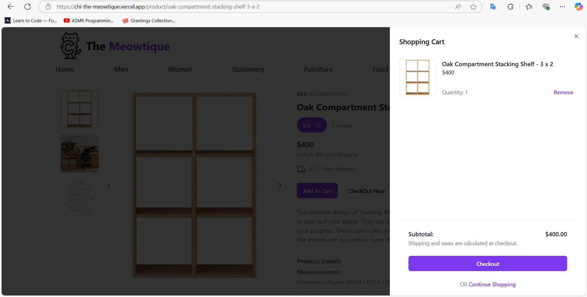
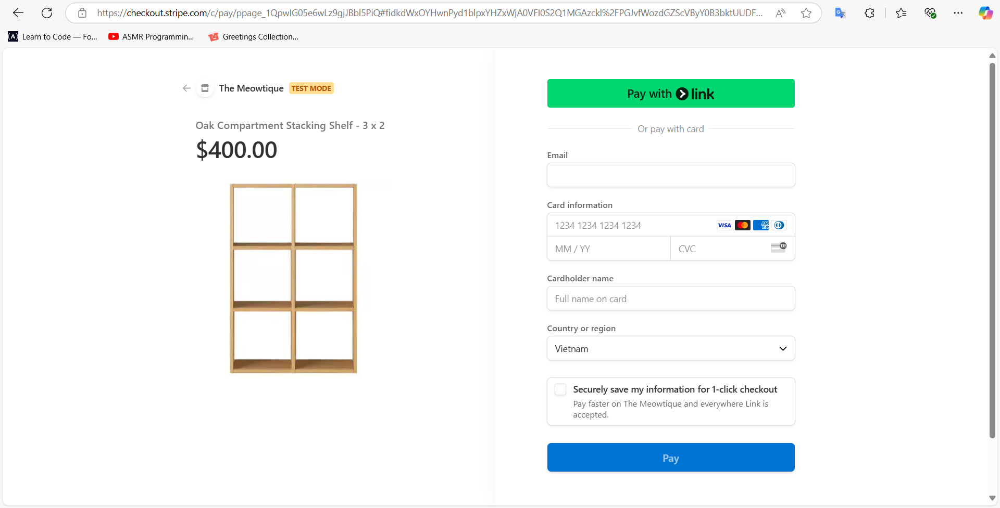

<div align="center">
  
</div>

<div align="center">
    <h1>THE MEOWTIQUE</h1> 
    <strong>The Meowtique</strong> is an E-commerce website offering a seamless shopping experience, secure Stripe payment integration, and efficient content management using Sanity.io. Built with Next.js, styled with TailwindCSS and ShadCN UI, it ensures accessibility and modern UI components.
</div>

## 📋 Table of Content

1. [Introduction](#introduction)
2. [Getting started](#getting-started)
3. [Technologies Used](#technologies-used)
4. [UI Interface](ui-interface)
5. [References](#references)
6. [MIT License](#mit-license)

<!-- Introduction -->
## 🪧 Introduction <a name="introduction"></a>
### 🔗 Link Demo: [the-meowtique](https://chi-the-meowtique.vercel.app/)
The Meowtique is a beautifully crafted e-commerce platform that allows users to browse, add items to their shopping cart, and complete payments securely using **Stripe**. All product data, including images and descriptions, are sourced from **Muji.vn**.


## 🚀 Getting started <a name="getting-started"></a>

### 🎯 Installation
1. **Clone the repository:**
     ```bash
     git clone https://github.com/chihiro-203/the-meowtique.git
     cd cat-guardian
     ```
2. **Install dependencies:**
     ```bash
     npm install
     ```

### 💨 Running the Application
1. **Start the application:**
     ```bash
     npm run dev
     ```
2. **Open in browser:**
Navigate to ```http://localhost:3000``` to explore the store.

## ⚙️ Technologies Used <a name="technologies-used"></a>


| Stack | Usage |
|--------|--------|
| **Next.js** | Server-side rendering, SEO-friendly architecture |
| **React.js** | Component-based frontend development |
| **TailwindCSS** | Utility-first CSS framework for responsive design |
| **ShadCN UI** | Pre-built, accessible UI components |
| **Sanity.io** | Headless CMS for content management |
| **Stripe API** | Secure payment processing |
| **Lucide Icons** | Modern and flexible icons |
| **Vercel** | Deployment and hosting |

## 🎇 UI Interface <a name="ui-interface"></a>
### 🏠 Homepage UI:
<div align ="center">
    
</div>

### 💸 Sales UI:
<div align ="center">
    
</div>

### 🎨 Category UI:
<div align ="center">
    
</div>

### 📦 Product UI:
<div align ="center">
    
</div>

### 📦 Shopping Cart UI:
<div align ="center">
    
</div>

### 💳 Checkout UI:
<div align ="center">
    
</div>

## 📚 References <a name="references"></a>

- [Next.js Documentation](https://nextjs.org/docs)
- [Sanity.io Documentation](https://www.sanity.io/docs)
- [Stripe Payment API](https://stripe.com/docs/api)
- UI/UX inspiration from **Muji.vn**

## 📜 License <a name="license"></a>

This project is licensed under [MIT License](https://github.com/chihiro-203/cat-guardian/blob/main/LICENSE).

<!-- My note -->

<!-- ✅ Deploying to Sanity.Studio

Success! Studio deployed to https://the-meowtique.sanity.studio/

Add studioHost: 'the-meowtique'
to defineCliConfig root properties in sanity.cli.js or sanity.cli.ts
to avoid prompting for hostname on next deploy.

commerce Website complete with secure Stripe payment integration, efficient content management through Sanity.io and beautiful styling using Tailwindcss and Shadcn UI for accessible components.

Installation Command: npm i stripe use-shopping-cart next-sanity @stripe/stripe-js @sanity/image-url --force -->